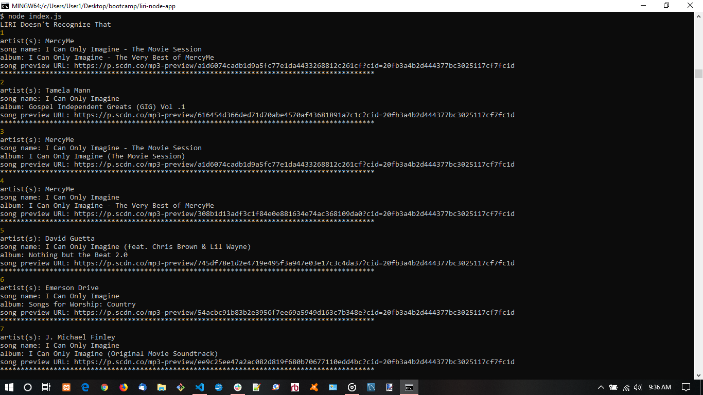
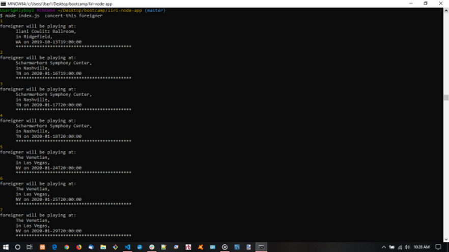

# liri-node-app

Liri is a command line app that allows the user to input songs, movies,and bands and find corresponding information for each category.

## Usage

Spotify This:
User enters spotify-this-song "song name", and liri returns artist name, name of the song, album name, and a preview URL

Movie-This:
User enters movie-this "movie name", and liri returns the movie title, year released, rating, and poster link

Concert-This:
User enters concert-this "artist name", and liri returns the venue name and location, as well as the date of the event.

do-what-it-says:
User enters do-what-it-says and the text from a file is read and the output displayed.
